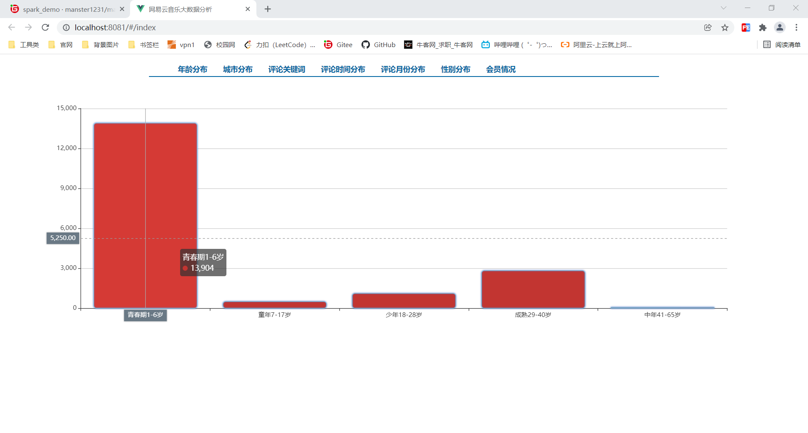
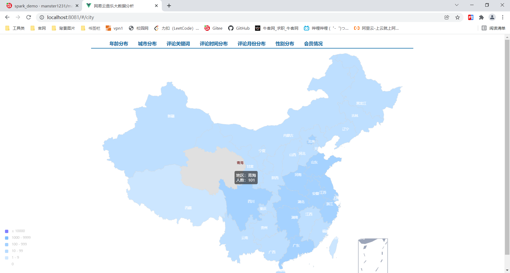
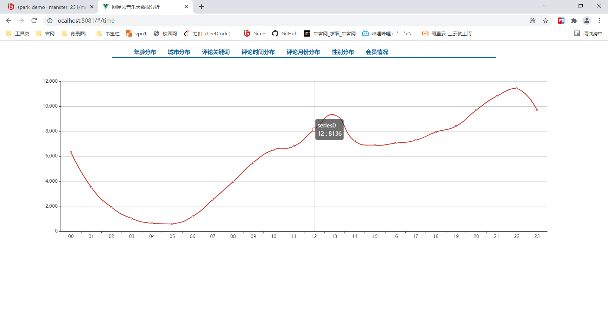
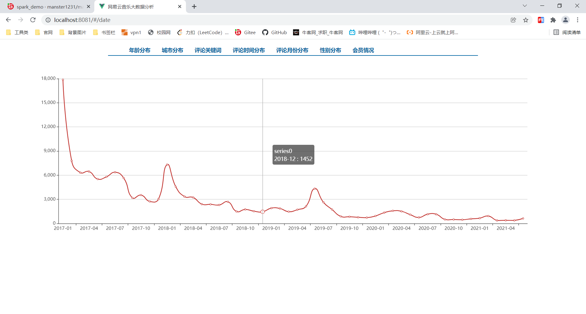
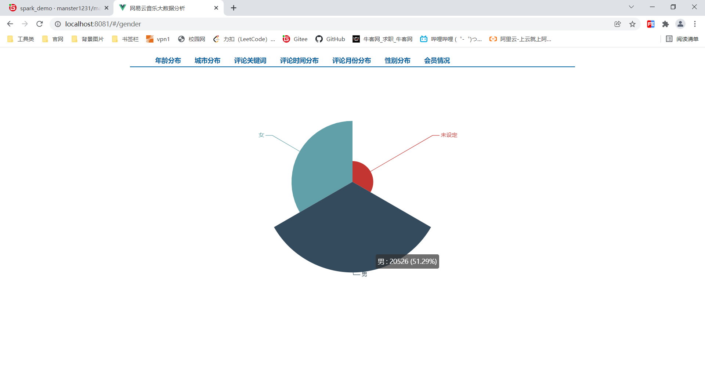
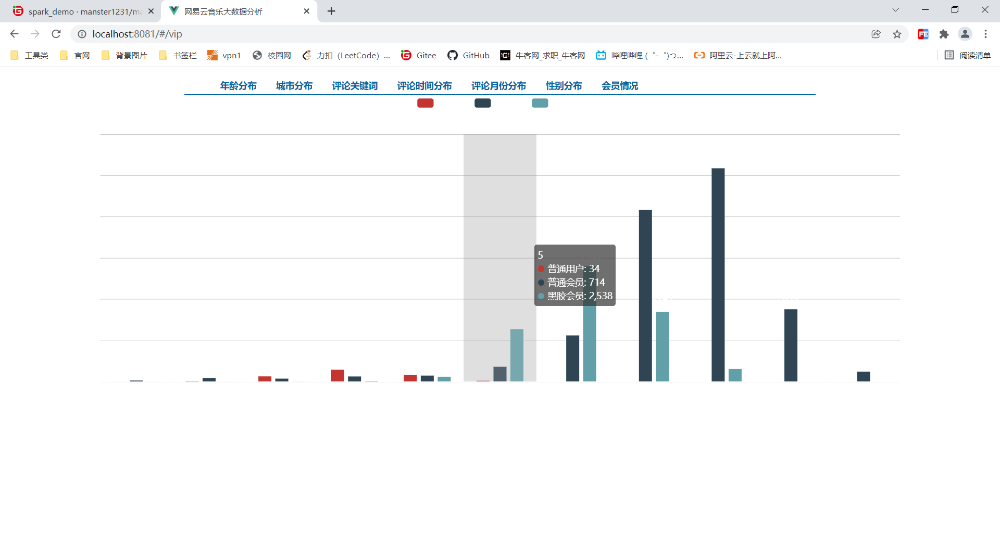

# manster网易云音乐分析

#### 介绍
一个简单的网易云音乐大数据分析，采用 Saprk 框架进行分析，并以前端 vue 使用 ECharts 作为展示

#### 环境

jdk-1.8，scala-2.12.13，nodejs-12.1.0，hadoop-2.7.3

#### 安装教程

1.  首先安装好以上环境(配到环境变量中)
2.  使用 vscode 或者 webstorm 打开 music-demo 文件夹，输入 `npm install`, 然后 `npm run serve`
3.  后端项目就是简单的一个一个单独的启动项，类似 javase 的单个程序，使用 idea 打开，下载 jar 包，一个一个进行运行即可

#### 样例

# manster的纪录片大数据分析
[https://gitee.com/manster1231](https://gitee.com/manster1231)
#### 介绍
基于B站纪录片使用 Python 进行爬取，使用 Spark 进行对数据的分析，使用 ECharts 展示数据

#### 环境

jdk-1.8，scala-2.12.13，nodejs-12.1.0，hadoop-2.7.3，python-3.7

#### 安装教程

1.  首先安装好以上环境(配到环境变量中)
2.  爬虫使用pycharm或者命令行界面打开，直接运行即可
3.  使用 vscode 或者 webstorm 打开 music-demo 文件夹，输入 `npm install`, 然后 `npm run serve`
4.  后端项目就是简单的一个一个单独的启动项，类似 javase 的单个程序，使用 idea 打开，下载 jar 包，一个一个进行运行即可

#### 样例
首页

词云

弹幕发送时间图

纪录片受欢迎程度

各国纪录片集数分析

各国纪录片数量分析

各国每集时长分析

纪录片地区分布图

粉丝数与发布数

纪录片类型分布图

各国纪录片时长分析

各国记录片风格分布

弹幕视频点

